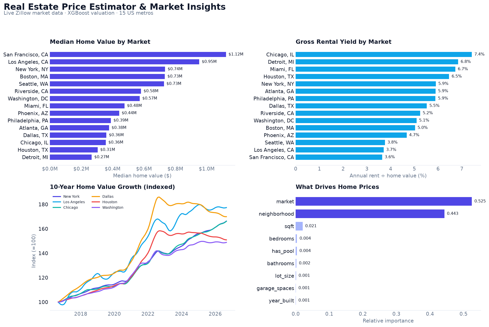

# 🏙️ Real Estate Price Estimator & Market Insights Dashboard

[](https://github.com/armand-vw/Property-Price-Market-Dashboard/actions/workflows/ci.yml)
[](https://armand-vw.github.io/Property-Price-Market-Dashboard/)

[](LICENSE)

An end-to-end, production-style machine-learning application that estimates
property values and surfaces **live US market insights** across the 15 largest
metros. Built with Python, Streamlit, XGBoost, scikit-learn and Plotly.

<p align="center">
  <a href="https://armand-vw.github.io/Property-Price-Market-Dashboard/">
    
  </a>
</p>


> **Data:** market values, rents and trends are **real monthly data from
> [Zillow Research](https://www.zillow.com/research/data/)** (ZHVI home values,
> ZORI rents), fetched live from the public CDN with a committed snapshot
> fallback. Listing-level features are synthesised and calibrated to each
> neighbourhood's real median value.

---

## 📈 Results at a Glance

| | |
| --- | --- |
| Markets / neighbourhoods | **15** / **180** real US locations |
| Training listings | **7,022**, anchored to real neighbourhood medians |
| Model | XGBoost · 80/20 hold-out · `log1p` target |
| **R²** | **0.919** |
| **MAPE** | **14.7%** (median APE 12.6%) |
| **MAE** | **$89,171** |
| Improvement vs. median baseline | **74.8% lower MAE** |

---

## 🔗 Live Demo

| | Link |
| --- | --- |
| **Interactive project page** (GitHub Pages, no install) | **https://armand-vw.github.io/Property-Price-Market-Dashboard/** |
| **Full app** (self-hosted) | Run locally or with Docker — see [Quickstart](#-quickstart) |

The GitHub Pages site is a **static preview** rendered from the real data and
trained model at build time. The full interactive app (live model inference and
the valuation tool) is **self-contained**: run it locally with
`streamlit run app.py` or with Docker. No third-party hosting is required — the
market snapshot and fitted model are committed, so it even runs fully offline
(`RPE_OFFLINE=1`).

---

## ✨ Highlights

- **Live market data** for 15 major US metros (New York, Los Angeles, Chicago,
  Dallas, Houston, Washington DC, Philadelphia, Miami, Atlanta, Boston, Phoenix,
  San Francisco, Riverside, Detroit, Seattle) — real monthly median home values
  **and rents**, with MoM / YoY / 5-year changes, 10-year trends and gross
  rental yield.
- **Real neighbourhood values** — each market carries its actual neighbourhoods
  and their median values from a compact committed snapshot (the raw file is
  ~100 MB; it is reduced at build time).
- **Shareable URLs** — the selected market, location and estimate inputs are
  reflected in the URL query string, so any view can be bookmarked or linked.
- **Resilient data layer** — live Zillow fetch with a 24-hour cache, disk
  caching, a manual **Refresh** button, an automatic monthly GitHub Actions
  refresh, and fallback to the committed snapshot if the network fails.
- **Market-anchored valuation model** — synthetic listings calibrated to real
  neighbourhood price-per-sqft, so estimates track local price levels
  (San Francisco ≫ Detroit) while retaining rich features (beds, baths, size,
  age, pool, garage).
- **Leak-free scikit-learn pipeline** with a log-transformed target and
  quantified evaluation (MAE, RMSE, MAPE, median APE, R², baseline).
- **Empirical valuation ranges** from held-out residual quantiles rather than an
  over-confident symmetric `± MAPE` band.
- **Polished multi-tab dashboard** — Markets, Market Analytics, Model Insights
  and Data Explorer, plus a live valuation tool with neighbourhood comparison.

---

## 📁 Project Structure

```
Property-Price-Market-Dashboard/
├── app.py                       # Streamlit dashboard (entry point)
├── market_data.py               # Zillow fetch, cache, fallback, aggregates
├── data_loader.py               # Market-anchored synthesis + cleaning
├── model.py                     # Pipeline, training, metrics, persistence
├── config.py                    # Paths, schema, seeds, palette, constants
├── market_data/                 # Committed real-market snapshot (small)
│   ├── markets.csv              # 15 metros
│   ├── market_history.csv       # monthly metro home values
│   ├── market_rents.csv         # monthly metro rents (ZORI)
│   ├── neighborhood_meta.csv    # neighbourhood values + price anchors
│   └── neighborhood_history.csv # monthly neighbourhood home values
├── scripts/
│   ├── build_market_snapshot.py # Builds market_data/ from Zillow (~100 MB once)
│   ├── build_site.py            # Renders the GitHub Pages site into docs/
│   └── build_images.py          # Generates the README charts into assets/
├── docs/                        # GitHub Pages landing page (static)
├── assets/                      # README chart images
├── tests/                       # pytest suite (offline)
├── .github/workflows/
│   ├── ci.yml                   # CI: ruff lint + pytest on push / PR
│   └── refresh-market-data.yml  # Monthly Zillow snapshot refresh
├── requirements.txt             # Pinned runtime dependencies
├── requirements-dev.txt         # Dev tools (ruff, pytest, matplotlib)
├── pyproject.toml               # Project metadata + ruff/pytest config
├── Dockerfile                   # Self-contained image (no external hosting)
├── .dockerignore
├── data/                        # Generated CSV + fetch cache (git-ignored)
└── models/                      # Fitted pipeline + metrics (committed)
```

---

## 🚀 Quickstart

```bash
git clone git@github.com:armand-vw/Property-Price-Market-Dashboard.git
cd Property-Price-Market-Dashboard

python3 -m venv .venv
source .venv/bin/activate          # Windows: .venv\Scripts\activate
pip install -r requirements.txt

streamlit run app.py               # opens http://localhost:8501
```

The fitted model and market snapshot are committed, so the app starts instantly.
If `models/price_model.joblib` is ever missing, the app regenerates the dataset
from the committed market snapshot and retrains automatically.

> **Debian/Ubuntu users:** if `python3 -m venv` fails, install the venv package
> with `sudo apt install python3.12-venv` (or use `pip install virtualenv`).

### Development

```bash
pip install -r requirements.txt -r requirements-dev.txt

pytest -q                          # run the test suite (offline)
ruff check .                       # lint
python scripts/build_images.py     # regenerate the README charts
```

### Run with Docker

The image is self-contained (app + committed market snapshot + fitted model), so
it needs no network at runtime:

```bash
docker build -t property-insights .
docker run --rm -p 8501:8501 property-insights        # http://localhost:8501

# fully offline (serve the committed snapshot, no outbound calls):
docker run --rm -p 8501:8501 -e RPE_OFFLINE=1 property-insights
```

### Optional CLI

```bash
python data_loader.py --force            # rebuild data/housing.csv
python model.py                          # retrain + print evaluation summary
python market_data.py                    # print the live market overview
python scripts/build_market_snapshot.py  # refresh market_data/ from Zillow
python scripts/build_site.py             # regenerate the GitHub Pages site
```

---

## 🧠 How It Works

### 1. Real market data (`market_data.py`)

Zillow Research publishes monthly **ZHVI** (smoothed, seasonally-adjusted typical
home value) by geography. The app:

1. fetches the **metro** file (~4 MB) at runtime, caches it for 24 hours on disk,
   and falls back to the committed snapshot on any network error;
2. reads **neighbourhood** values from the committed snapshot produced by
   `scripts/build_market_snapshot.py`, which downloads the ~100 MB neighbourhood
   file once and reduces it to the 15 markets × top 12 neighbourhoods.

For each market the app derives the latest median value, month-over-month,
year-over-year and 5-year changes, a 10-year trend, and — from the ZORI rent
series — the median rent and **gross rental yield** (annual rent ÷ home value).
A **Refresh** button re-fetches live data on demand, and a scheduled GitHub
Actions workflow rebuilds the committed snapshot monthly.

### 2. Market-anchored synthesis (`data_loader.py`)

Listing-level features are generated per neighbourhood and priced as:

```
price = neighbourhood_base_per_sqft × sqft × age × beds × baths × pool × garage × lot × noise
```

where `neighbourhood_base_per_sqft` is the **real** neighbourhood median value
divided by an assumed median home size. This yields 7,000+ realistic listings
across 15 markets and 180 locations. Missing values and duplicates are injected
so cleaning is exercised, then:

1. duplicates dropped, types coerced, impossible rows removed,
2. **neighbourhood-median imputation** (global median fallback),
3. IQR winsorisation of `price` and `sqft`,
4. derived `price_per_sqft` and `property_age`.

### 3. Model pipeline (`model.py`)

```
Raw features
    │
    ├── Numeric  → SimpleImputer(median) → StandardScaler ─┐
    │                                                       ├──► XGBRegressor
    └── Category → SimpleImputer(mode)   → OneHotEncoder ──┘   (market, neighborhood)
                            wrapped in  ──► TransformedTargetRegressor(log1p / expm1)
```

The full object is persisted with `joblib`, so a single artifact accepts raw
features and returns prices in dollars. If XGBoost is unavailable the pipeline
falls back to `RandomForestRegressor`.

### 4. Evaluation (`model.py`)

80/20 train/test split, scored in dollars: MAE, RMSE, MAPE, median APE, R², and
a baseline comparison against always predicting the median.

---

## 📊 Model Performance

Reproduced with the default configuration (`RANDOM_SEED=42`):

| Metric | Value |
| --- | --- |
| Estimator | `XGBRegressor` (700 trees, lr 0.03, depth 5) |
| Listings (train / test) | 5,617 / 1,405 |
| Markets / locations | 15 / 180 |
| MAE | **$89,171** |
| RMSE | **$131,178** |
| MAPE | **14.66%** |
| Median APE | **12.62%** |
| R² | **0.919** |
| Improvement vs. median baseline | **74.8% lower MAE** |

**Top price drivers:** market, neighbourhood, square footage, bedrooms, pool.

> Metrics are regenerated into `models/metrics.json` on every training run.

---

## 🖥️ Dashboard Tour

- **Executive KPI row** — listings, the selected market's **real** median value
  and YoY, model accuracy (100 − MAPE) and R².
- **🌎 Markets** — live median value, MoM/YoY/5-year changes, rent and gross
  rental yield, a 10-year value trend, latest-value / YoY / yield comparison
  across all 15 markets, and a real neighbourhood value table.
- **📊 Market Analytics** — price-per-sqft scatter by location (colour-coded by
  age band), median listing price by location, and feature importances.
- **🤖 Model Insights** — metric cards, predicted-vs-actual parity and residual
  diagnostics.
- **🗂️ Data Explorer** — neighbourhood market summary, filterable listings and
  CSV export.
- **🎯 Live Valuation Tool (sidebar)** — pick a market and location, set the
  property details (including lot size) and press **Estimate Value** to get the
  estimate, an empirical valuation range, and a comparison against the **real**
  neighbourhood median.
- **🔗 Shareable URLs** — the current market, location and inputs are encoded in
  the URL; copy the link from the sidebar to share or bookmark a view.
- **📡 Data status** — the sidebar shows whether market data is `live` or from
  the snapshot, when it was fetched, and a **Refresh** button.

---

## 🧪 Testing

```bash
pytest -q
```

The suite is **network-free**: it uses the committed market snapshot and small
synthetic fixtures, covering data reproducibility, cleaning invariants, schema
validation, market aggregation, live-to-snapshot fallback, pipeline fitting,
feature-importance aggregation and inference ranges.

---

## 🛠️ Engineering Notes & Design Decisions

- **No target leakage.** All preprocessing is fitted inside the pipeline on the
  training fold only.
- **Real where it matters.** Market levels and neighbourhood values are real;
  only listing-level attributes are synthesised (no free listing-level source
  exists). This is stated in the UI and README.
- **Resilient by design.** Live fetch → disk cache → committed snapshot, with an
  environment-tunable timeout. The app never depends on the network being up.
- **Honest uncertainty.** Valuation ranges come from empirical residual
  quantiles, not a symmetric `± MAPE` band.
- **Bounded threads.** `N_JOBS` is capped (`min(4, cpu)`) to avoid OpenMP
  oversubscription; override with `RPE_N_JOBS`.
- **Single source of truth.** Paths, schema, seeds and constants live in
  `config.py`.

---

## 🗺️ Roadmap

- [x] Add rents (ZORI) and gross rental yield per market.
- [ ] Add inventory, days-on-market and sale-to-list metrics.
- [ ] Swap synthetic listings for a real listing-level dataset behind the same
      loader interface.
- [ ] SHAP values for per-prediction explainability.
- [ ] Hyper-parameter tuning with Optuna and cross-validated MAPE.
- [x] Containerise with Docker (self-contained, no external hosting).
- [x] Live real market data with snapshot fallback.
- [x] Continuous integration with GitHub Actions (`pytest` + `ruff`).
- [x] Static project page on GitHub Pages.

---

## 👤 About

Built by **armand-vw** as a portfolio project demonstrating end-to-end data
science and full-stack Python: real-data ingestion and resilience, feature
engineering, a leak-free ML pipeline, quantified evaluation, and a polished
interactive product.

[](https://github.com/armand-vw)

---

## 📄 License & Attribution

Released under the MIT License.

Market data © [Zillow](https://www.zillow.com/research/data/) (ZHVI home values
and ZORI rents), used under their public research terms. Listing-level estimates
are illustrative and do not constitute financial advice.
